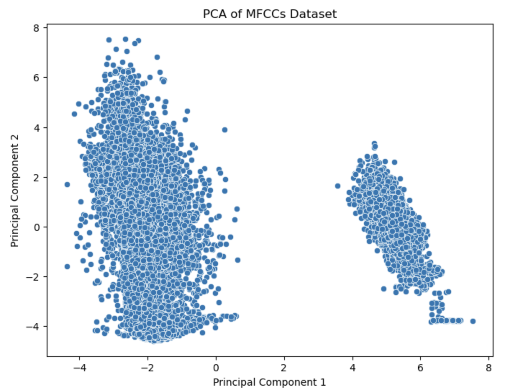
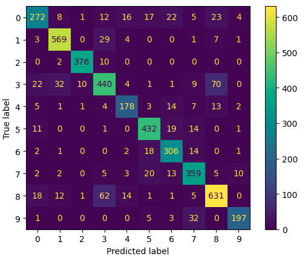

# Speech Recognition Project

## Motivation

This project was initiated out of a profound interest in audio signal processing and its applications within the realm of machine learning. The complex and intriguing characteristics of sound present unique challenges and opportunities for exploration, especially in the domain of speech recognition. The overarching goal is to employ machine learning techniques to accurately recognize and differentiate between specific individuals' voices, pushing the boundaries of audio analysis and its practical applications.

## Overview

The Speech Recognition Project is designed to develop a machine learning (ML) model capable of identifying and distinguishing the voices of 10 different individuals. With over 1000 samples per target, each consisting of 7-second audio clips, the project leverages the rich dataset provided by the Mozilla Common Voice open-source project. The approach is centered around analyzing Mel Frequency Cepstral Coefficients (MFCCs) of these audio clips, utilizing neural network architectures that are adept at capturing the temporal properties inherent in sound.

## Dataset and Testing Methodology

The dataset, sourced from the Mozilla Common Voice project, features recordings from 10 unique individuals, with each contributing over 1000 samples of 7-second clips. This extensive dataset supports a thorough approach to training and testing the machine learning models, ensuring efficacy and accuracy in voice recognition.

After initial experiments with both mel-spectrograms and MFCCs, it was found that MFCCs significantly outperformed mel-spectrograms, leading to their selection as the primary feature for analysis. MFCCs are favored for their ability to closely mimic the human auditory system's response, capturing key spectral properties of sound that are critical for distinguishing between different voices. The inclusion of MFCC derivatives and second derivatives (delta and delta-delta MFCCs) further enriches the models' understanding of sound, providing insights into the rate of change in features that are essential for capturing temporal variations in speech.

<figure>
  <figcaption>Underlying patterns of MFCCS dataset through PCA</figcaption>
  
</figure>

## Tested Models and Performance Metrics

Three ML models were developed, each with varying complexity and tailored to best utilize the MFCC features:

### 1. Basic Model
```
Input -> GlobalMaxPooling1D -> Dense -> Dense -> Output
```
- **Test Accuracy**: 0.60
- **Loss**: 1.28

### 2. LSTM Model
```
Input -> LSTM -> GlobalAveragePooling1D -> Flatten -> Dense -> Dropout -> Output
```
- **Val Loss**: 0.9
- **Train Accuracy**: 0.89
- **Val Accuracy**: 0.83

This model, while training quickly and achieving decent results, displayed a tendency to overfit, underscoring the need for effective regularization strategies.

### 3. Advanced Bi-LSTM Model
```
Input -> Bi-LSTM -> Bi-LSTM -> GlobalAveragePooling1D -> Flatten -> Dense -> Dropout -> Output
```
- **Val Loss**: 0.64
- **Val Accuracy**: 0.86
- **Test Accuracy**: 0.85

Enhanced with light regularization in the Bi-LSTM and Dense layers, along with recurrent output regularization, this model emerged as the most stable and performant, accurately capturing the nuances of the target voices.
<figure>
<figcaption>---- Test set confusion matrix ----</figcaption>

</figure>

### Understanding Bidirectional LSTMs

In this context, "Bidirectional" processing means that the model analyzes data both forwards and backwards. This approach allows for a more comprehensive understanding of the sequence by capturing dependencies that might only be apparent when looking at the information from both directions. For speech recognition, this dual analysis is particularly effective, enabling the model to grasp the context and nuances of speech patterns more thoroughly.

## Conclusion

The Speech Recognition Project demonstrates the potential of machine learning in the field of audio signal processing, particularly through the focused application of MFCCs and neural network architectures. By progressing from basic models to more complex and finely tuned ones, the project highlights the importance of feature selection, model architecture, and regularization in achieving accurate and reliable speech recognition. The advanced Bi-LSTM model, with its bidirectional processing and optimized use of MFCCs, signifies a significant stride forward in voice recognition technology, offering insights and frameworks for future research and applications in sound analysis.

